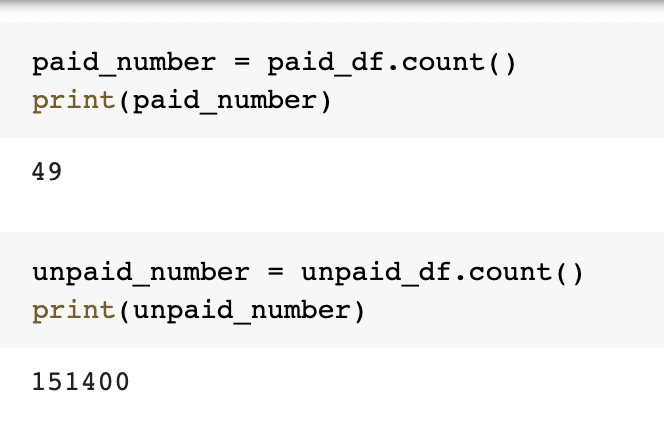
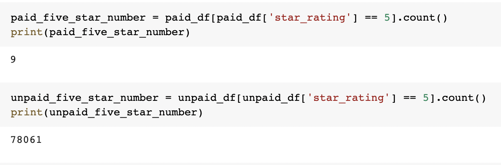
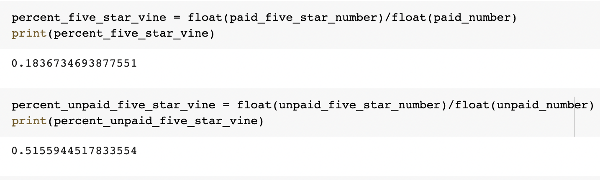

# Amazon Vine Analysis

## Overview of the Analysis

In this project, I am analyzing Amazon reviews that were written by members of the paid Amazon Vine program. Specifically, I am looking at video DVDs that are sold by Amazon. This is a large dataset which includes workout videos, movies, TV series, and a variety of other genres. I am determining if there is any bias toward favorable reviews from Vine members. 

## Results

In my analysis, I discover that the dataset is very large and cumbersome. Therefore, I find a way to make it more manageable by filtering and combining the dataset in a meaningful and useful way. I follow the extract, transform and load process. This process allows me to achieve the following results:

- In this analysis, there is 49 paid reviews (Vine Reviews) and 151,400 non-paid reviews (non-Vine Reviews. Both sets of reviews were filtered where the total vote count is greater than or equal to 20. This is done to ensure that I have reviews that are more likely to be helpful and avoid dividing by zero in further analysis.

- Of the 49 Vine reviews, 9 reviews were 5 stars. For non-Vine reviews, 78,061 reviews were 5 stars. 

- This is to say that, 18% of Vine Reviews were 5 stars. While, 51% of non-Vine Reviews were 5 stars. 

## Summary

This would suggest that there is a bias for reviews in the Vine program. In other words, Vine reviews are less likely to give a 5 star review than then their non-Vine Review counterparts. The large difference in percentage points from the two reviews would indicate that something is influencing the reviews. 
An additional analysis that I would recommend to further support my statement would be to filter for verified purchases, place each star rating in a "bin" and cross examine each bin with its respective Vine or non-Vine counterpart. I could than run a linear regression test and descriptive statistics to verify my null hypothesis, which would be that there is no difference in reviews from Vine Reviews and non-Vine Reviews. 